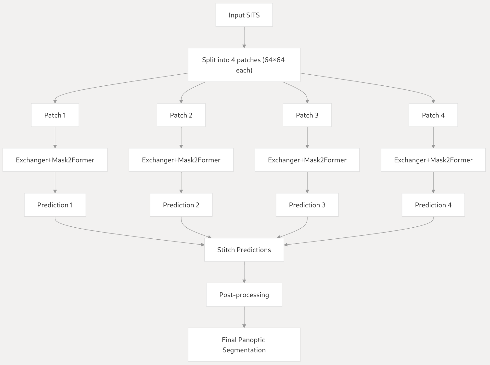

# Exchanger4SITS: Revisiting the Encoding of Satellite Image Time Series
The official code repository for the paper "Revisiting the Encoding of Satellite Image Time Series".

[](https://arxiv.org/abs/2305.02086)
[](https://github.com/TotalVariation/Exchanger4SITS)
[](https://github.com/TotalVariation/Exchanger4SITS)

## Requirements
```
conda create -n exchanger
conda activate exchanger
conda install pytorch==1.13.1 torchvision==0.14.1 torchaudio==0.13.1 pytorch-cuda=11.7 -c pytorch -c nvidia
conda install -c conda-forge cudatoolkit-dev=11.7
conda install -c conda-forge torchinfo zarr geopandas timm

python -m pip install -e detectron2

conda install -c conda-forge torch-scatter==2.1.0

Already installed as requirements by detectron2:

[X] conda install -c conda-forge tensorboard
[X] conda install -c conda-forge fvcore
[X] conda install -c conda-forge iopath
```
---
```
conda create -n exchanger
conda activate exchanger
conda install pytorch==2.0.0 torchvision==0.15.0 torchaudio==2.0.0 pytorch-cuda=11.7 -c pytorch -c nvidia
conda install -c conda-forge cudatoolkit-dev=11.7
conda install -c conda-forge torchinfo zarr geopandas timm

pip install torch-scatter -f https://data.pyg.org/whl/torch-2.0.0+cu117.html
pip install -e detectron2
pip install opencv-python
pip install "numpy<2"
```
---
## News 
- ~~The preprint is under review.~~
- ~~The codebase is still under construction and therefore is subject to further modifications.~~
- The paper has been accepted to BMVC 2023 as an oral presentation.
- The model weights have been made available on [Zenodo](https://zenodo.org/record/8406435).
- The slides and the accompanying video, from which you can gain a better intuitive understanding of the development philosophy, can be accessed via the following [link](https://totalvariation.github.io/publications/).
- ~~I have been focusing on expanding this work to a journal paper and the code is subject to further modifications.~~
- I look forward to collaboration to upgrade the code repo (e.g., having it integrated to the Hugging Face Ecosystem) and extend this work to a full journal paper.


## Schematic Overview of **Collect--Update--Distribute**


## Navigating the Repo with DeepWiki (powered by [Devin.ai](https://devin.ai/))

A useful document generated by [DeepWiki](https://deepwiki.com/TotalVariation/Exchanger4SITS) can facilitate you navigating the repo, which is pretty amazing. The following two figures are copied from the DeepWiki document, highlighting the critical implementations.




## Qualitative Results from Exchanger+Mask2Former on PASTIS


## New SOTA Results on [PASTIS Benchmark](https://github.com/VSainteuf/pastis-benchmark) Dataset
### PASTIS - Semantic Segmentation

[](https://paperswithcode.com/sota/semantic-segmentation-on-pastis?p=rethinking-the-encoding-of-satellite-image)

| Model Name         | mIoU | #Params (M) | FLOPs |
| ------------------ |----- |------------ | ------|
| U-TAE | 63.1 | 1.09 | 47G |
| TSViT | 65.4 | 2.16 | 558G |
| **Exchanger+Unet** | 66.8 | 8.08 | 300G |
| **Exchanger+Mask2Former** | **67.9** | 24.59 | 329G |

### PASTIS - Panoptic Segmentation

[](https://paperswithcode.com/sota/panoptic-segmentation-on-pastis?p=rethinking-the-encoding-of-satellite-image)

| Model Name         | SQ | RQ | PQ | #Params (M) | FLOPs |
| ------------------ |----|----|----|-------------|-------|
| UConvLSTM+PaPs  | 80.2 | 43.9 | 35.6 | 2.50 | 55G |
| U-TAE+PaPs | 81.5 | 53.2 | 43.8 | 1.26 | 47G |
| **Exchanger+Unet+PaPs** | 80.3 | 58.9 | 47.8 | 9.99 | 301G |
| **Exchanger+Mask2Former** | **84.6** | **61.6** | **52.6** | 24.63 | 332G |

## License


## Notes
- The panoptic segmentation model Exchanger+Mask2Former has been trained by splitting the input into four 64x64 patches and stitch
the prediction results together. Later on, I found this trick is crucial for replicating the results.
## Citation

If you find our work or code useful in your research, please consider citing the following BibTex entry:

```BibTex
@article{cai2023rethinking,
  title={Rethinking the Encoding of Satellite Image Time Series},
  author={Cai, Xin and Bi, Yaxin and Nicholl, Peter and Sterritt, Roy},
  journal={arXiv preprint arXiv:2305.02086},
  year={2023}
}
```

## Acknowledgements

The codebase is built upon the following great work:

- [GPViT](https://github.com/ChenhongyiYang/GPViT)
- [Mask2Former](https://github.com/facebookresearch/Mask2Former)
- [utae-paps](https://github.com/VSainteuf/utae-paps)
- [tpe](https://github.com/jnyborg/tpe)
- [DeepSatModels](https://github.com/michaeltrs/DeepSatModels)

I would like to thank Zenodo for hosting the model weights and appreciate the constructive and insightful comments from BMVC reviewers.
